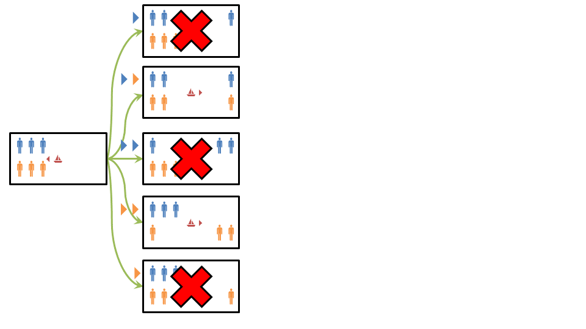
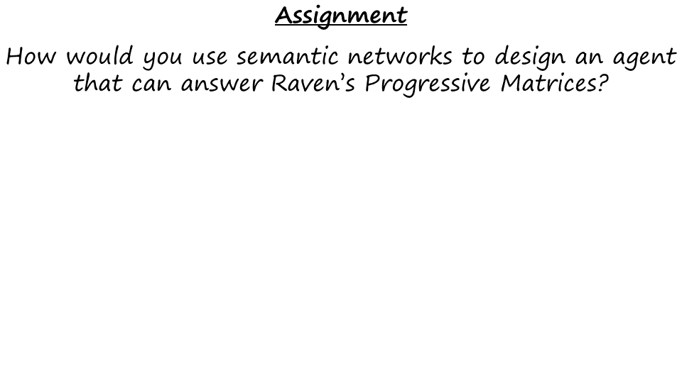
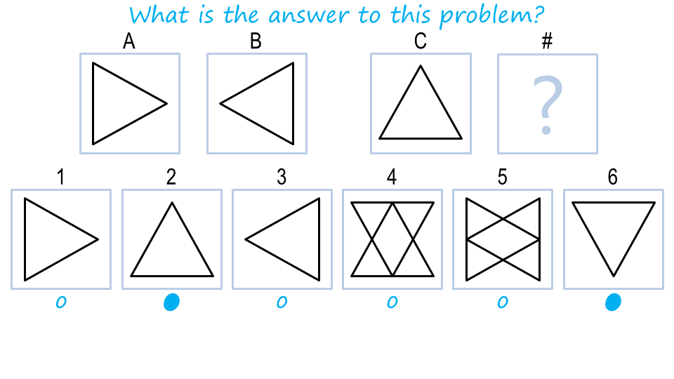

Section 09: Characteristics of Good Representations
:::::::::::::::::::::::::::::::::::::::::::::::::::

.. youtube:: Rel9lgL0ugY
	:height: 315
	:width: 560
	:align: left

|Characteristics of Good Representations| 

Now that we have seen semantic networks in action, we can ask ourselves
the important question. What makes a knowledge representation, a good
representation? Well, a good knowledge representation makes
relationships explicit. So in the two by one matrix problem, there were
all these objects, circles and triangles and dots. There were there this
relationship between them, left off and inside. And the semantic that
worked made all of them explicit. It exposed the natural constraints of
the problem. A good representation works at the right level of
abstraction. So that it captures everything that needs to be captured,
and yet. Removes all the details that are not needed. So representation,
a good representation, is transparent, concise, captures only what is
needed, but complete, captures everything that is needed. It is fast,
because it doesn’t have all the details that are not needed. And it is
computable. It allows you to draw from the inferences that need to be
drawn, in order to address the problem at hand.

.. |Preview| image:: ../../_static/SemanticNetworks/Slide01-01.PNG
.. |Preview 1| image:: ../../_static/SemanticNetworks/Slide01-02.PNG
.. |Representations| image:: ../../_static/SemanticNetworks/Slide02.PNG
.. |Introduction to Semantic Networks| image:: ../../_static/SemanticNetworks/Slide03-01.PNG
.. |Introduction to Semantic Networks 1| image:: ../../_static/SemanticNetworks/Slide03-02.PNG
.. |Introduction to Semantic Networks 2| image:: ../../_static/SemanticNetworks/Slide03-03.PNG
.. |Exercise Constructing Semantic Nets I| image:: ../../_static/SemanticNetworks/Slide04.PNG
.. |Exercise Constructing Semantic Nets I 1| image:: ../../_static/SemanticNetworks/Slide05.PNG
.. |Exercise Constructing Semantic Nets II| image:: ../../_static/SemanticNetworks/Slide06.PNG
.. |Exercise Constructing Semantic Nets II 1| image:: ../../_static/SemanticNetworks/Slide07.PNG
.. |Structure of Semantic Networks| image:: ../../_static/SemanticNetworks/Slide08.PNG
.. |Characteristics of Good Representations| image:: ../../_static/SemanticNetworks/Slide09.PNG
.. |Discussion Good Representations| image:: ../../_static/SemanticNetworks/Slide10.PNG
.. |Discussion Good Representations 1| image:: ../../_static/SemanticNetworks/Slide11.PNG
.. |Guards and Prisoners| image:: ../../_static/SemanticNetworks/Slide12-01.PNG
.. |Guards and Prisoners 1| image:: ../../_static/SemanticNetworks/Slide12-02.PNG
.. |Semantic Networks for Guards Prisoners| image:: ../../_static/SemanticNetworks/Slide13.PNG
.. |Solving the Guards and Prisoners Problem| image:: ../../_static/SemanticNetworks/Slide14-01.PNG

.. |Solving the Guards and Prisoners Problem 2| image:: ../../_static/SemanticNetworks/Slide14-03.PNG
.. |Exercise Guards and Prisoners II| image:: ../../_static/SemanticNetworks/Slide18-01.PNG
.. |Exercise Guards and Prisoners II 1| image:: ../../_static/SemanticNetworks/Slide18-02.PNG
.. |Exercise Guards and Prisoners II 2| image:: ../../_static/SemanticNetworks/Slide18-03.PNG
.. |Exercise Guards and Prisoners III| image:: ../../_static/SemanticNetworks/Slide19-01.PNG
.. |Exercise Guards and Prisoners III 1| image:: ../../_static/SemanticNetworks/Slide20.PNG
.. |Represent Reason for Analogy Problems| image:: ../../_static/SemanticNetworks/Slide21-01.PNG
.. |Represent Reason for Analogy Problems 1| image:: ../../_static/SemanticNetworks/Slide21-02.PNG
.. |Exercise Represent Reason for Ravens| image:: ../../_static/SemanticNetworks/Slide22.PNG
.. |Exercise Represent Reason for Ravens 1| image:: ../../_static/SemanticNetworks/Slide23.PNG
.. |Exercise How do we choose a match| image:: ../../_static/SemanticNetworks/Slide24.PNG
.. |Exercise How do we choose a match 1| image:: ../../_static/SemanticNetworks/Slide25.PNG
.. |Choosing Matches by Weights| image:: ../../_static/SemanticNetworks/Slide26-01.PNG
.. |Choosing Matches by Weights 1| image:: ../../_static/SemanticNetworks/Slide26-02.PNG
.. |Discussion Choosing a Match by Weight| image:: ../../_static/SemanticNetworks/Slide27-01.PNG

.. |Wrap Up| image:: ../../_static/SemanticNetworks/Slide31.PNG
.. |Final Quiz| image:: ../../_static/SemanticNetworks/Slide34-01.PNG

.. |Final Quiz 2| image:: ../../_static/SemanticNetworks/Slide34-03.PNG
.. |Final Quiz 3| image:: ../../_static/SemanticNetworks/Slide34-04.PNG
.. |Final Quiz 4| image:: ../../_static/SemanticNetworks/Slide34-05.PNG
.. |Final Quiz 5| image:: ../../_static/SemanticNetworks/Slide34-06.PNG
