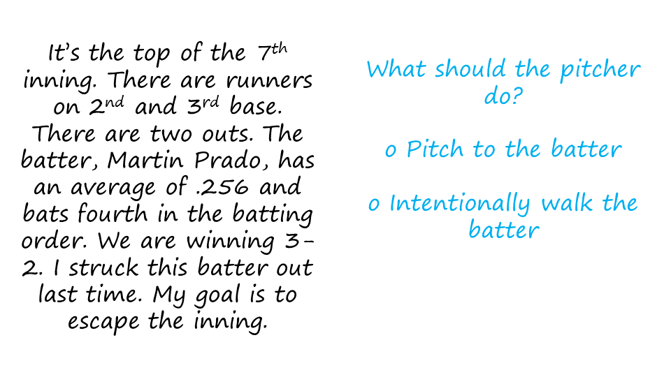
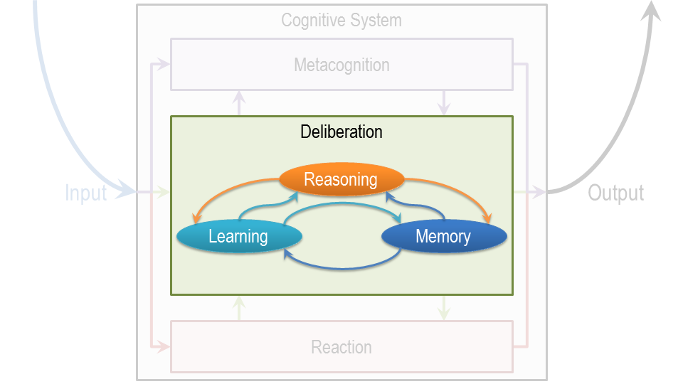

Section 08: Assumptions of Cognitive Architectures
::::::::::::::::::::::::::::::::::::::::::::::::::

.. youtube:: bwKHN3Ob6zs
	:height: 315
	:width: 560
	:align: left

|Assumptions of Cognitive Architectures| 
The school of AI that works on cognitive architectures makes sort of
fundamental assumptions about the nature of cognitive agents. First,
that cognitive agents are goal oriented, or goal directed. They have
goals and they take actions in the pursuit of those goals. Second, that
these cognitive agents live in a rich, complex, dynamic environments.
Third, this cognitive agent used knowledge of the world in order to
pursue their goals in this rich complex dynamic environments. Fourth,
that this knowledge is particular abstraction that captures the
important things about the world that the level of abstraction and
removes all the details. And at that level of abstraction, knowledge is
captured in the form of symbols. Fifth, the cognitive agents are very
flexible. The behavior is dependent upon the environment. As environment
changes, so does the behavior. And sixth cognitive agents learn from
their experiences. They’re constantly learning as they interact with the
world.

.. |Preview| image:: ../../_static/ProductionSystems/Slide01-01.PNG
.. |Preview 1| image:: ../../_static/ProductionSystems/Slide01-02.PNG
.. |Exercise A Pitcher| image:: ../../_static/ProductionSystems/Slide02-01.PNG

.. |Exercise A Pitcher 2| image:: ../../_static/ProductionSystems/Slide03.PNG
.. |Function of a Cognitive Architecture| image:: ../../_static/ProductionSystems/Slide04.PNG
.. |Levels of Cognitive Architectures| image:: ../../_static/ProductionSystems/Slide05-01.PNG
.. |Exercise Levels of Architectures| image:: ../../_static/ProductionSystems/Slide06.PNG
.. |Exercise Levels of Architectures 1| image:: ../../_static/ProductionSystems/Slide07.PNG
.. |Assumptions of Cognitive Architectures| image:: ../../_static/ProductionSystems/Slide08.PNG
.. |Architecture Content Behavior| image:: ../../_static/ProductionSystems/Slide09-01.PNG
.. |Architecture Content Behavior 1| image:: ../../_static/ProductionSystems/Slide09-02.PNG

.. |A Cognitive Architecture for Production Systems 1| image:: ../../_static/ProductionSystems/Slide10-02.PNG
.. |Return to the Pitcher| image:: ../../_static/ProductionSystems/Slide11-01.PNG
.. |Return to the Pitcher 1| image:: ../../_static/ProductionSystems/Slide11-02.PNG
.. |Return to the Pitcher 2| image:: ../../_static/ProductionSystems/Slide11-03.PNG
.. |Action Selection| image:: ../../_static/ProductionSystems/Slide12-01.PNG
.. |Action Selection 1| image:: ../../_static/ProductionSystems/Slide12-02.PNG
.. |Putting Content in the Architecture| image:: ../../_static/ProductionSystems/Slide13.PNG
.. |Bringing in Memory| image:: ../../_static/ProductionSystems/Slide14-01.PNG
.. |Bringing in Memory 1| image:: ../../_static/ProductionSystems/Slide14-02.PNG
.. |Exercise Production System in Action I| image:: ../../_static/ProductionSystems/Slide15.PNG
.. |Exercise Production System in Action I 1| image:: ../../_static/ProductionSystems/Slide16.PNG
.. |Exercise Production System in Action II| image:: ../../_static/ProductionSystems/Slide17.PNG
.. |Exercise Production System in Action II 1| image:: ../../_static/ProductionSystems/Slide18.PNG
.. |Exercise System in Action III| image:: ../../_static/ProductionSystems/Slide19.PNG
.. |Exercise System in Action III 1| image:: ../../_static/ProductionSystems/Slide20.PNG
.. |Chunking| image:: ../../_static/ProductionSystems/Slide21.PNG
.. |Exercise Chunking| image:: ../../_static/ProductionSystems/Slide22.PNG
.. |Exercise Chunking 1| image:: ../../_static/ProductionSystems/Slide23.PNG
.. |Assignment Production Systems| image:: ../../_static/ProductionSystems/Slide25.PNG
.. |Wrap Up| image:: ../../_static/ProductionSystems/Slide26.PNG
.. |The Cognitive Connection| image:: ../../_static/ProductionSystems/Slide27-01.PNG
.. |The Cognitive Connection 1| image:: ../../_static/ProductionSystems/Slide27-02.PNG
.. |The Cognitive Connection 2| image:: ../../_static/ProductionSystems/Slide27-03.PNG
