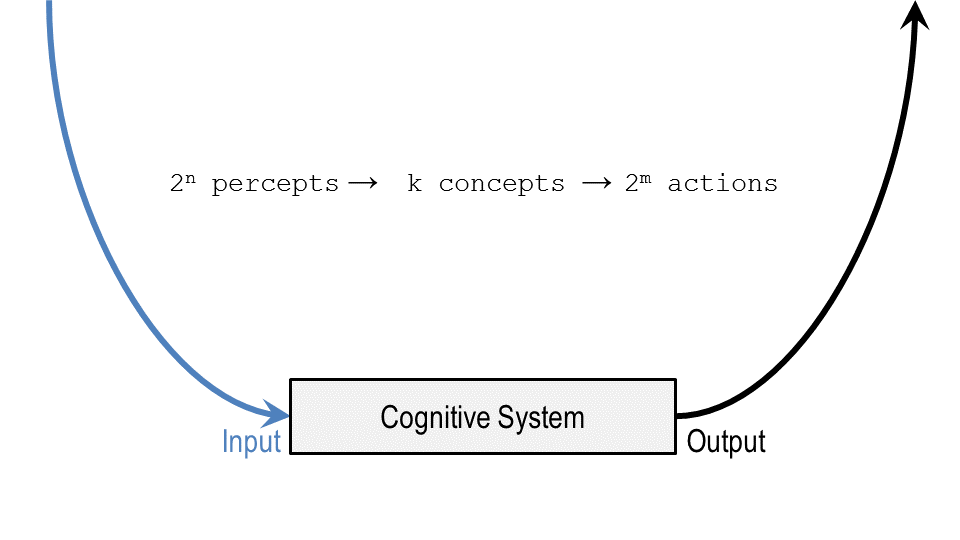

Section 21: Wrap-Up
:::::::::::::::::::

.. youtube:: ty_50gCUkHs
	:height: 315
	:width: 560
	:align: left

|Wrap Up| 
So today we’ve talked about classification, which is one of the biggest
problems in AI. We started by revisiting incremental concept learning
and reminding ourselves how it allowed us to take examples and abstract
away a concept. We then looked at the idea of equivalence classes and
how we can group sets of percepts into equivalence classes to establish
a particular instance of a concept. Within this is the hierarchies of
concepts, such as the animal kingdom, where animals can grow kind of
into vertebrae, birds and penguins. We then discuss the idea of
different types of concepts like axiomatic or exemplar concepts, and how
each of them have different definitions and different affordances.
Finally, we discuss bottom-up search, so instead of establish and
refine, we look at the lower level variables and abstract up from them.
Next, we’re going to move on to logic, which is a little bit unrelated
to this. But if you’re interested in classification, you can look ahead
to all our different lessons on design, such as diagnosis and
configuration. They’re going to really heavily leverage our idea of
classification.

Additional Reading:

.. reveal:: revealcbrreading1
    :showtitle: Show Reading
    :hidetitle: Hide Reading

    .. raw:: html

        

        <iframe height=600px width=800px src=../_static/readings/Classification/Stefik_Classification_1.pdf>
        </iframe>
        

        
or download :download:`here <../_static/readings/Classification/Stefik_Classification_1.pdf>`

.. reveal:: revealcbrreading1
    :showtitle: Show Reading
    :hidetitle: Hide Reading

    .. raw:: html

        

        <iframe height=600px width=800px src=../_static/readings/Classification/Stefik_Classification_2.pdf>
        </iframe>
        

        
or download :download:`here <../_static/readings/Classification/Stefik_Classification_2.pdf>`

.. |Preview| image:: ../../_static/Classification/Slide01-01.PNG
.. |Preview 1| image:: ../../_static/Classification/Slide01-02.PNG
.. |Exercise Concept Learning Revisited| image:: ../../_static/Classification/Slide02-01.PNG
.. |Exercise Concept Learning Revisited 1| image:: ../../_static/Classification/Slide02-02.PNG
.. |Exercise Concept Learning Revisited 2| image:: ../../_static/Classification/Slide03.PNG
.. |Classifying Birds| image:: ../../_static/Classification/Slide04.PNG
.. |The Challenge of Classification| image:: ../../_static/Classification/Slide05-01.PNG
.. |The Challenge of Classification 1| image:: ../../_static/Classification/Slide05-02.PNG
.. |The Challenge of Classification 2| image:: ../../_static/Classification/Slide05-03.PNG
.. |The Challenge of Classification 3| image:: ../../_static/Classification/Slide05-04.PNG
.. |The Challenge of Classification 4| image:: ../../_static/Classification/Slide05-05.PNG
.. |The Challenge of Classification 5| image:: ../../_static/Classification/Slide05-06.PNG
.. |Equivalence Classes| image:: ../../_static/Classification/Slide06-01.PNG

.. |Equivalence Classes 2| image:: ../../_static/Classification/Slide06-03.PNG
.. |Exercise Equivalence Classes| image:: ../../_static/Classification/Slide07.PNG
.. |Exercise Equivalence Classes 1| image:: ../../_static/Classification/Slide08.PNG
.. |Concept Hierarchies| image:: ../../_static/Classification/Slide09-01.PNG
.. |Concept Hierarchies 1| image:: ../../_static/Classification/Slide09-02.PNG
.. |Exercise Concept Hierarchies| image:: ../../_static/Classification/Slide10.PNG
.. |Exercise Concept Hierarchies 1| image:: ../../_static/Classification/Slide11.PNG
.. |Types of Concepts| image:: ../../_static/Classification/Slide12.PNG
.. |Axiomatic Concepts| image:: ../../_static/Classification/Slide13-01.PNG
.. |Axiomatic Concepts 1| image:: ../../_static/Classification/Slide13-02.PNG
.. |Prototype Concepts| image:: ../../_static/Classification/Slide14-01.PNG
.. |Prototype Concepts 1| image:: ../../_static/Classification/Slide14-02.PNG
.. |Prototype Concepts 2| image:: ../../_static/Classification/Slide14-03.PNG
.. |Prototype Concepts 3| image:: ../../_static/Classification/Slide14-04.PNG
.. |Exemplar Concepts| image:: ../../_static/Classification/Slide15-01.PNG
.. |Exemplar Concepts 1| image:: ../../_static/Classification/Slide15-02.PNG
.. |Order of Concepts| image:: ../../_static/Classification/Slide16.PNG
.. |Exercise Order of Concepts| image:: ../../_static/Classification/Slide17.PNG
.. |Exercise Order of Concepts 1| image:: ../../_static/Classification/Slide18.PNG
.. |Bottom-Up Search| image:: ../../_static/Classification/Slide19-01.PNG
.. |Bottom-Up Search 1| image:: ../../_static/Classification/Slide19-02.PNG
.. |Assignment Classification| image:: ../../_static/Classification/Slide20.PNG
.. |Wrap Up| image:: ../../_static/Classification/Slide21.PNG
