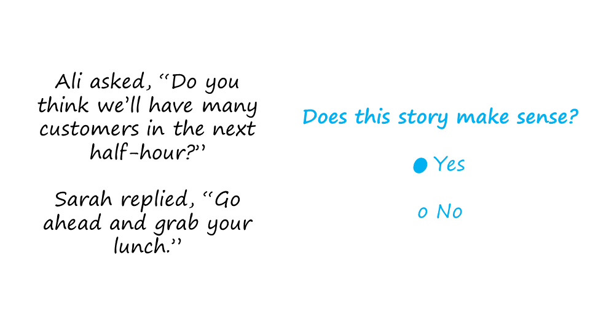
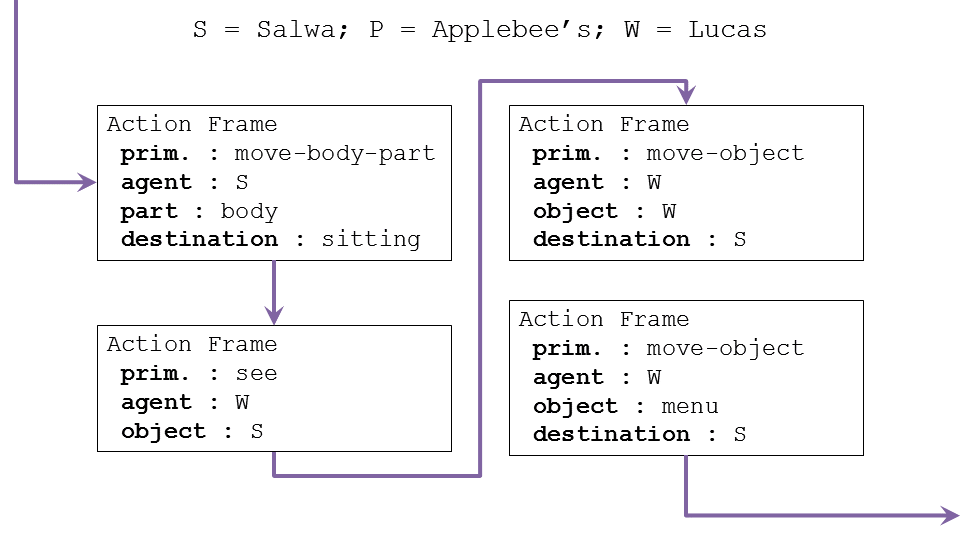
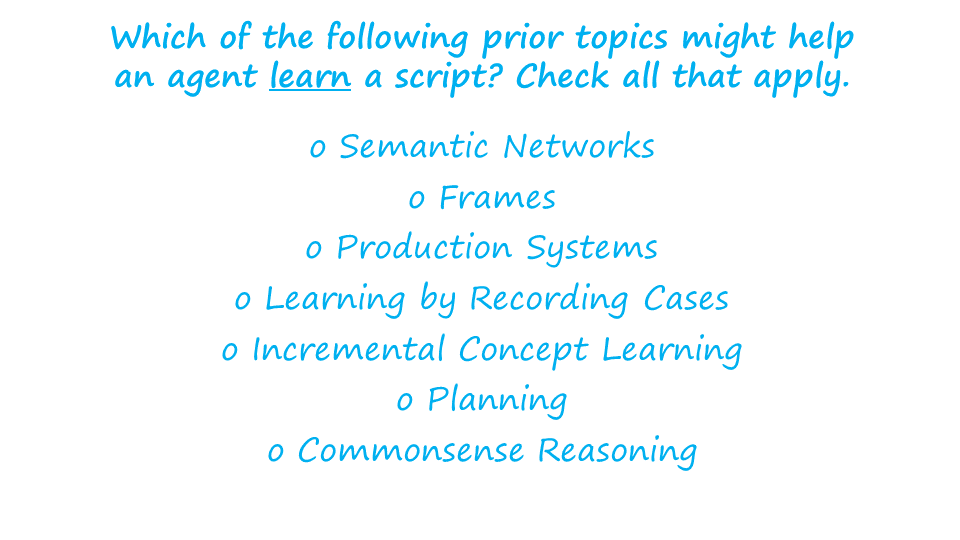
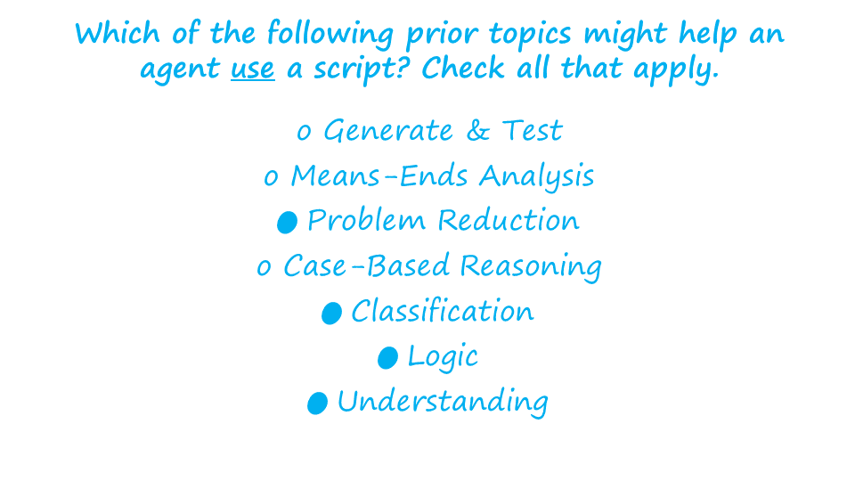
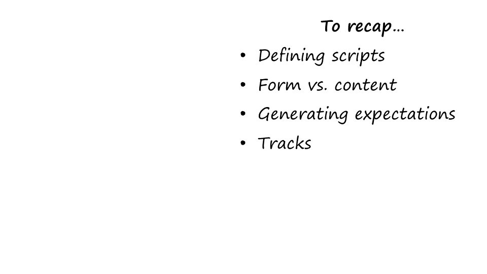

Section 14: Exercise: Using a Script
::::::::::::::::::::::::::::::::::::

.. youtube:: nUB3YEcj0V0
	:height: 315
	:width: 560
	:align: left

|Exercise Using a Script| 
Okay, let us do one more exercise together. This predicate exercise has
to do with using a script rather than learning a script. Which of these
topics that we have discussed earlier apply to an agent using a script?
Check all that may apply.

.. |Preview| image:: ../../_static/Scripts/Slide01-01.PNG
.. |Preview 1| image:: ../../_static/Scripts/Slide01-02.PNG
.. |Exercise A Simple Conversation| image:: ../../_static/Scripts/Slide02.PNG
.. |Exercise A Simple Conversation 1| image:: ../../_static/Scripts/Slide03.PNG

.. |Definition of Scripts| image:: ../../_static/Scripts/Slide06.PNG
.. |Parts of a Script| image:: ../../_static/Scripts/Slide07.PNG
.. |Constructing a Script| image:: ../../_static/Scripts/Slide08-01.PNG
.. |Constructing a Script 1| image:: ../../_static/Scripts/Slide08-02.PNG
.. |Constructing a Script 2| image:: ../../_static/Scripts/Slide08-03.PNG

.. |Form vs Content 1| image:: ../../_static/Scripts/Slide09-02.PNG
.. |Using a Script to Generate Expectations| image:: ../../_static/Scripts/Slide10.PNG
.. |Tracks| image:: ../../_static/Scripts/Slide11.PNG

.. |Exercise Learning a Script 1| image:: ../../_static/Scripts/Slide13.PNG
.. |Exercise Using a Script| image:: ../../_static/Scripts/Slide14.PNG

.. |Assignment Scripts| image:: ../../_static/Scripts/Slide16.PNG

