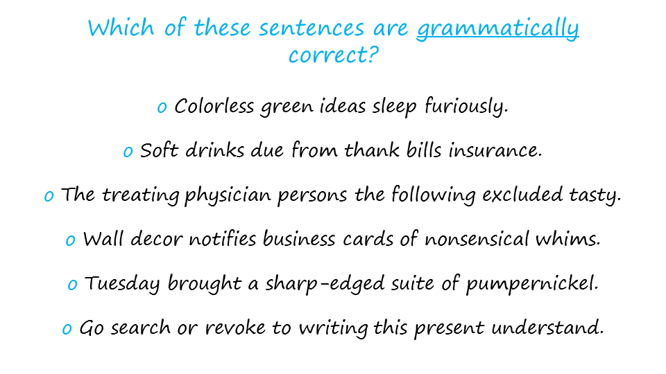
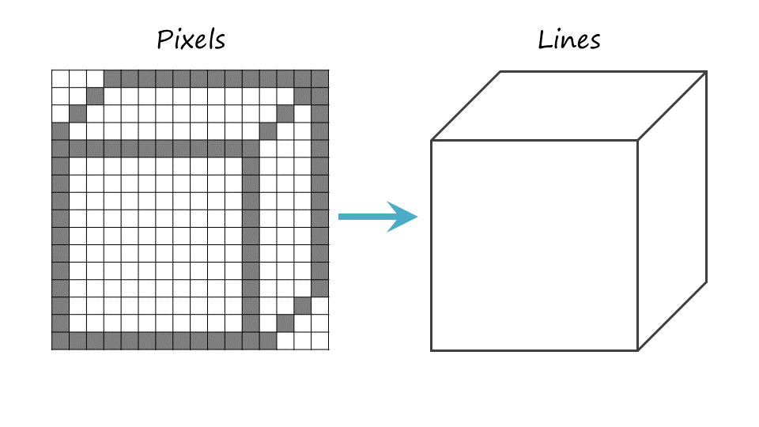
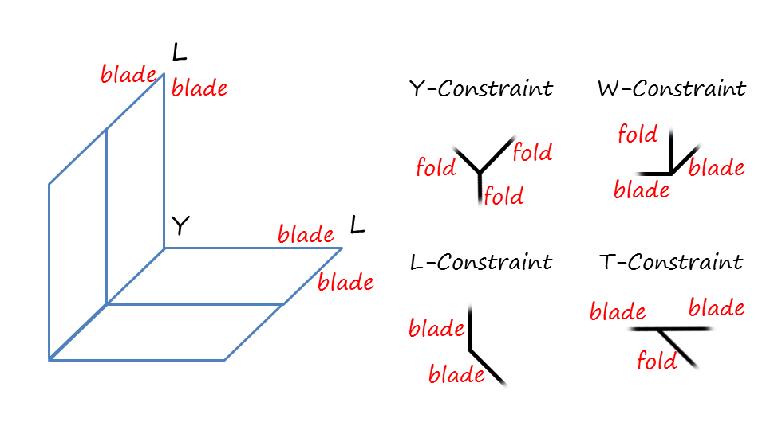
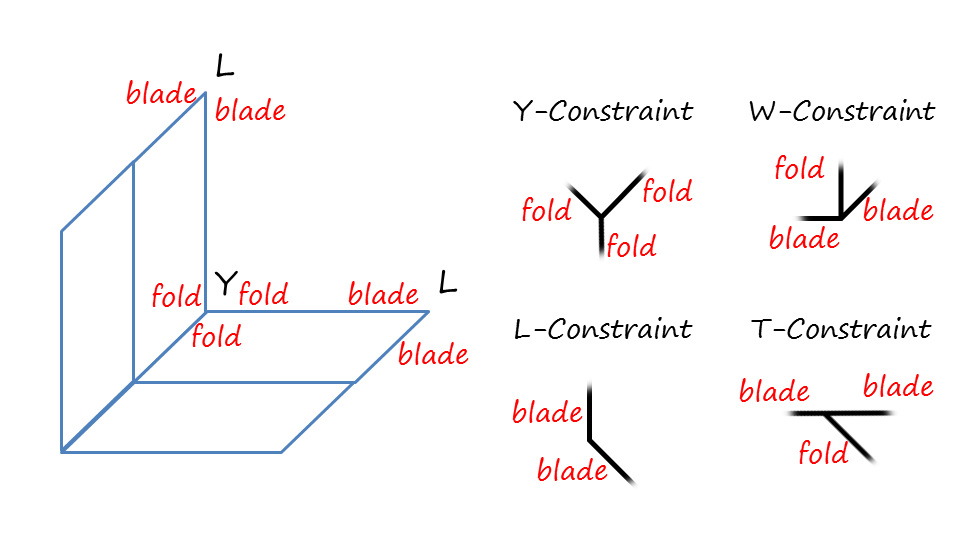
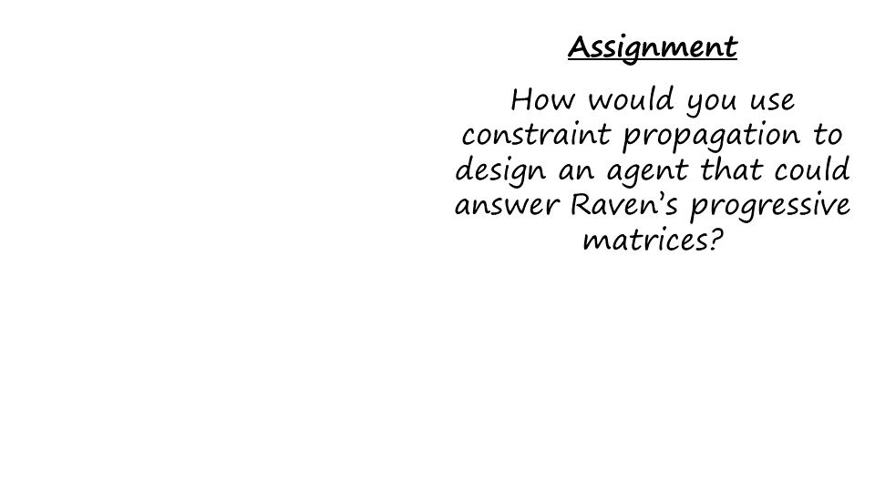

Section 08: Exercise: Recognizing 3D Figures
:::::::::::::::::::::::::::::::::::::::::::::

.. youtube:: UyjCINwZzII
	:height: 315
	:width: 560
	:align: left

|Line Labeling| 
Of course, I will focus here is on constraint propagation, not on
computive vision, we are simply using some aspect of computive vision to
illustrate constraint propagation. In particular, let us zoom into a
specific subtask of object recognition, In this subtask, lines are
grouped into surfaces and the orientations of the surfaces are
identified via the perpendiculars. The method we’ll use for this task is
called, line labelling, the method of line labelling makes extensive use
of constraints.

.. |Preview| image:: ../../_static/ConstraintPropagation/Slide01-01.PNG
.. |Preview 1| image:: ../../_static/ConstraintPropagation/Slide01-02.PNG
.. |Exercise Recognizing 3D Figures| image:: ../../_static/ConstraintPropagation/Slide02-01.PNG
.. |Exercise Recognizing 3D Figures 1| image:: ../../_static/ConstraintPropagation/Slide02-02.PNG
.. |Exercise Recognizing 3D Figures 2| image:: ../../_static/ConstraintPropagation/Slide03.PNG

.. |Exercise Gibberish Sentences 1| image:: ../../_static/ConstraintPropagation/Slide05.PNG
.. |Constraint Propagation Defined| image:: ../../_static/ConstraintPropagation/Slide06.PNG

.. |From Pixels to 3D 1| image:: ../../_static/ConstraintPropagation/Slide07-02.PNG
.. |From Pixels to 3D 2| image:: ../../_static/ConstraintPropagation/Slide07-03.PNG
.. |Line Labeling| image:: ../../_static/ConstraintPropagation/Slide08.PNG
.. |Constraints Intersections and Edges| image:: ../../_static/ConstraintPropagation/Slide09-01.PNG
.. |Constraints Intersections and Edges 1| image:: ../../_static/ConstraintPropagation/Slide09-02.PNG
.. |Constraints Intersections and Edges 2| image:: ../../_static/ConstraintPropagation/Slide09-03.PNG
.. |Exercise Assembling the Cube I| image:: ../../_static/ConstraintPropagation/Slide10.PNG
.. |Exercise Assembling the Cube I 1| image:: ../../_static/ConstraintPropagation/Slide11.PNG
.. |Exercise Assembling the Cube II| image:: ../../_static/ConstraintPropagation/Slide12.PNG
.. |Exercise Assembling the Cube II 1| image:: ../../_static/ConstraintPropagation/Slide13.PNG
.. |More Complex Images| image:: ../../_static/ConstraintPropagation/Slide14-01.PNG
.. |More Complex Images 1| image:: ../../_static/ConstraintPropagation/Slide14-02.PNG
.. |More Complex Images 2| image:: ../../_static/ConstraintPropagation/Slide14-03.PNG
.. |More Complex Images 3| image:: ../../_static/ConstraintPropagation/Slide14-04.PNG

.. |More Complex Images 6| image:: ../../_static/ConstraintPropagation/Slide14-07.PNG
.. |More Complex Images 7| image:: ../../_static/ConstraintPropagation/Slide14-08.PNG
.. |Constraint Propagation for Natural Language Processing| image:: ../../_static/ConstraintPropagation/Slide15-01.PNG
.. |Constraint Propagation for Natural Language Processing 1| image:: ../../_static/ConstraintPropagation/Slide15-02.PNG
.. |Constraint Propagation for Natural Language Processing 2| image:: ../../_static/ConstraintPropagation/Slide15-03.PNG

.. |Wrap Up| image:: ../../_static/ConstraintPropagation/Slide17.PNG
