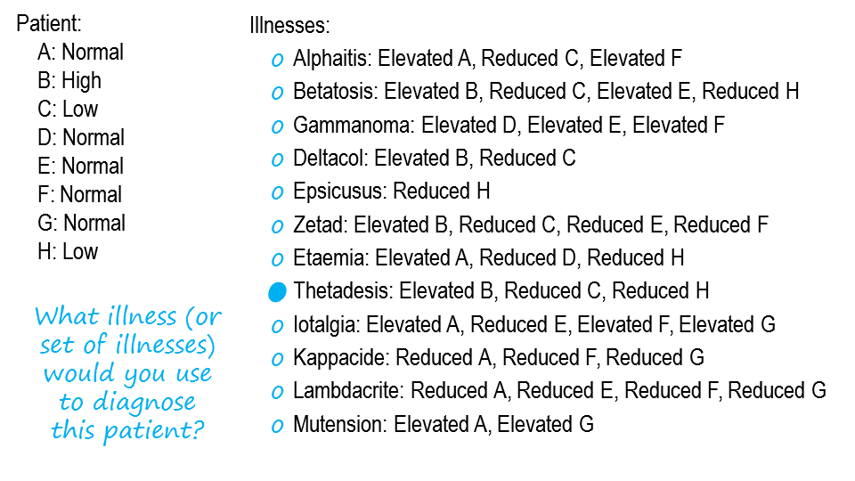
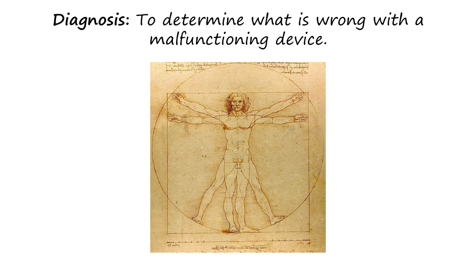
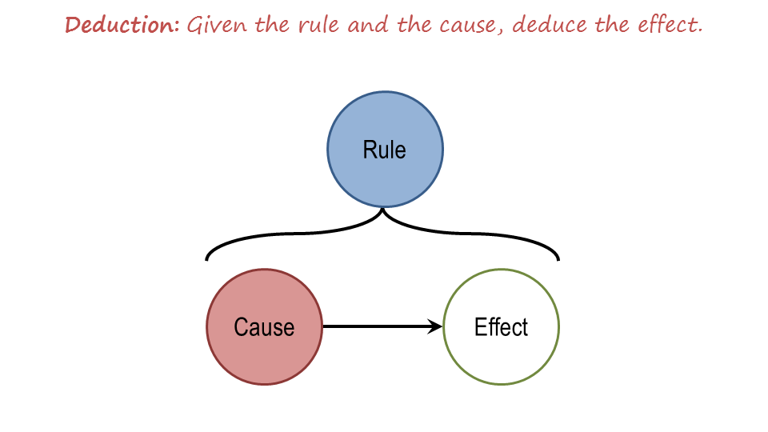
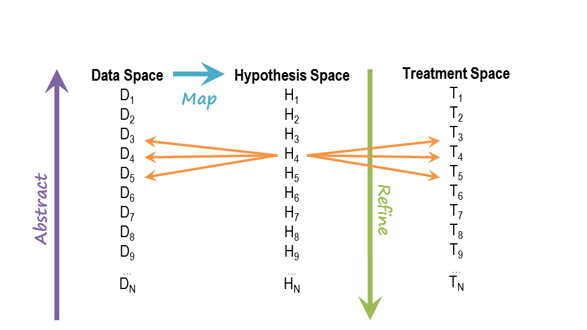

Section 03: Exercise: Diagnosing Illness I
::::::::::::::::::::::::::::::::::::::::::

.. youtube:: EfY0W6nG-WA
	:height: 315
	:width: 560
	:align: left

|Exercise Diagnosing Illness 1| 

That’s a good answer, David. Note that David did several things in
coming up with his answer. First, he made sure that his answer covers
all these signs and symptoms. This is the principle of coverage. We want
to make sure that the diagnostic conclusion actually accounts for all
the input data. Second, we chose a single hypothesis over a combination
of hypothesis, although the combination could have explain this data as
well. This is the principle of parsimony. In general, we want a simple
hypothesis for explaining the entire data. Third, these hypotheses can
have greatest interactions between them, and these interactions can make
your diagnostic task quite complicated. Fourth, they would use the term
explanation. This is an important aspect for diagnosis. We want a set of
hypotheses that could explain the input data. Now this [turns out to be
a relatively simple exercise] we did it in this simple exercise, because
there is one single disease that can, in fact, explain all the input
data. What would happen if there was no single hypothesis that could
cover the entire input data? Or what would happen if there were multiple
hypotheses that could equally well explain the input data? [turns out to
be a relatively simple exercise] diagnostic task can be quite
complicated.

.. |Preview| image:: ../../_static/Diagnosis/Slide01-01.PNG
.. |Preview 1| image:: ../../_static/Diagnosis/Slide01-02.PNG
.. |Exercise Diagnosing Illness| image:: ../../_static/Diagnosis/Slide02.PNG

.. |Defining Diagnosis 1| image:: ../../_static/Diagnosis/Slide04-02.PNG
.. |Data Space and Hypothesis Space| image:: ../../_static/Diagnosis/Slide05-01.PNG
.. |Data Space and Hypothesis Space 1| image:: ../../_static/Diagnosis/Slide05-02.PNG
.. |Data Space and Hypothesis Space 2| image:: ../../_static/Diagnosis/Slide05-03.PNG
.. |Data Space and Hypothesis Space 3| image:: ../../_static/Diagnosis/Slide05-04.PNG
.. |Data Space and Hypothesis Space 4| image:: ../../_static/Diagnosis/Slide05-05.PNG
.. |Problems with Diagnosis as Classification| image:: ../../_static/Diagnosis/Slide06-01.PNG
.. |Problems with Diagnosis as Classification 1| image:: ../../_static/Diagnosis/Slide06-02.PNG
.. |Problems with Diagnosis as Classification 2| image:: ../../_static/Diagnosis/Slide06-03.PNG
.. |Problems with Diagnosis as Classification 3| image:: ../../_static/Diagnosis/Slide06-04.PNG
.. |Problems with Diagnosis as Classification 4| image:: ../../_static/Diagnosis/Slide06-05.PNG
.. |Problems with Diagnosis as Classification 5| image:: ../../_static/Diagnosis/Slide06-06.PNG

.. |Deduction, Induction, Abduction 1| image:: ../../_static/Diagnosis/Slide07-02.PNG
.. |Deduction, Induction, Abduction 2| image:: ../../_static/Diagnosis/Slide07-03.PNG
.. |Criteria for Choosing a Hypothesis| image:: ../../_static/Diagnosis/Slide08-01.PNG
.. |Criteria for Choosing a Hypothesis 1| image:: ../../_static/Diagnosis/Slide08-02.PNG
.. |Criteria for Choosing a Hypothesis 2| image:: ../../_static/Diagnosis/Slide08-03.PNG
.. |Exercise Diagnosis as Abduction| image:: ../../_static/Diagnosis/Slide09.PNG
.. |Exercise Diagnosis as Abduction 1| image:: ../../_static/Diagnosis/Slide10.PNG
.. |Completing the Process| image:: ../../_static/Diagnosis/Slide11-01.PNG

.. |Completing the Process 2| image:: ../../_static/Diagnosis/Slide11-03.PNG
.. |Assignment Diagnosis| image:: ../../_static/Diagnosis/Slide12.PNG
.. |Wrap Up| image:: ../../_static/Diagnosis/Slide13.PNG
