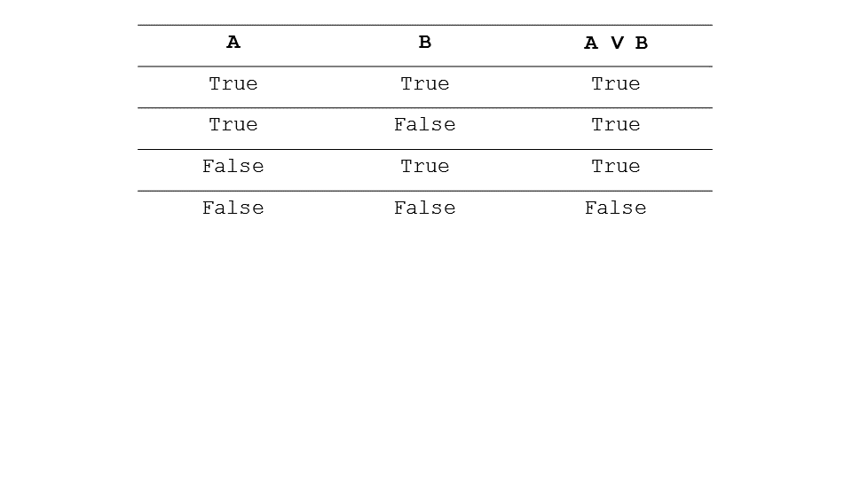

Section 11: Exercise: Practicing Formal Logic
::::::::::::::::::::::::::::::::::::::::::::::::

.. youtube:: 8VRkrzXk77g
        :height: 315
        :width: 560
        :align: left

.. image:: ../_static/LogicImages/Slide11.PNG
        :height: 200px
        :width: 350px
        :alt: Exercise Practicing Formal Logic
        :align: center

Okay David, what did you have for the first sentence? So for the first sentence, I created the predicates lays eggs, feathers, and reptile, and said if the animal lays eggs and the animal does not have feathers that implies the animal is a reptile. For the second one, I said if the animal has feathers or the animal has talons that implies that the animal is a bird. So animal feathers or talons, feathers or talons. For the third, which is a longer one, I said, if the the animal lays eggs and the animal has a beak and the animal flies, all three of these all in a chain, that implies the animal is a duck. And similar for the fourth one, we have three predicates on the left side. If the animal lays eggs, the animal has a beak, and the animal does not fly, then the animal is a Platypus. This guy shows us why a platypus is such a strange animal because we need to make a lot of caveats in order to find what a platypus really is. Good David, that looks right to me. So to wrap this part up, let us note that when we defined what a predicate was, we set up a predicate like Flies can map into true or false. Well okay, a predicate can map into true or false. What about complicated sentences like this, which are multiple predicates, as well as, implications? How do we find out whether the sentence as a whole maps into true or false? That’s what we’re going to look at next. We’re looking at truth tables.

Section 12: Truth Tables
:::::::::::::::::::::::::::

.. youtube:: dyrS1hZ-1uU
        :height: 315
        :width: 560
        :align: left

So we’ll now build truth tables for conjunctions and disjunctions and negations of sentences, so that we can find the truth of complex sentences stated in logic. Now many of you probably are familiar with truth tables, and if you are in fact familiar with truth tables, then you can skip this part and go directly to implication elimination. If you’re not familiar with this then please stay with me, but even so I’m going to go through this quite rapidly. So here is the truth table for A or B. If A is true, then B. If A is true and B is true, then A or B is true. If A is true and B is false, then A or B is still true, because A was true. If A is false and B is true, then A or B is true, because B was true. One of them is true, makes this true. If A is false and B is false, than A or B is false.

Section 13: Exercise: Truth Tables I
:::::::::::::::::::::::::::::::::::::::

.. youtube:: JrCEutcRqns
        :height: 315
        :width: 560
        :align: left

.. image:: ../_static/LogicImages/Slide13.PNG
        :height: 200px
        :width: 350px
        :alt: Exercise Truth Tables 1
        :align: center

.. codelens:: Truth_Tables_1

	a = True; b = True;
	exp1 = a or not b
	exp2 = not a or not b
	
	a = True; b = False;
	exp1 = a or not b
	exp2 = not a or not b

	a = False; b = True;
	exp1 = a or not b
	exp2 = not a or not b

	a = False; b = False;
	exp1 = a or not b
	exp2 = not a or not b

Let us try a couple of simple exercises. So here we have A, B and we want to find a truth value of A or not B. Given these values for A and B, can you please write down the truth values for A or not B. And similarly, for not A and not B.

Section 14: Exercise: Truth Tables I
:::::::::::::::::::::::::::::::::::::::

.. youtube:: YGVIEClsldM
        :height: 315
        :width: 560
        :align: left

.. image:: ../_static/LogicImages/Slide14.PNG
        :height: 200px
        :width: 350px
        :alt: Exercise Truth Tables 1
        :align: center

So for A or not B, I got that if A is ever true, then this has to be true, because it’s A or not B. When A is false the negation flips the value of B, so it makes it true when B is false, but keeps it false when B is true. For not A and not B, that means that any time either A or B is true, then this is all false. So when A is true, this is false. When B is true, this is false. When both are false, this becomes true, because those negations flip the values of both A and B.

Section 15: Exercise: Truth Tables II
::::::::::::::::::::::::::::::::::::::::

.. youtube:: Ix_fOQ_eDQU
        :height: 315
        :width: 560
        :align: left

.. image:: ../_static/LogicImages/Slide15.PNG
        :height: 200px
        :width: 350px
        :alt: Exercise Truth Tables 2
        :align: center

.. codelens:: Truth_Tables_2_Ex

	a = True; b = True; c = False;
	exp1 = a or (b and not c)
	
	a = False; b = True; c = True;
	exp2 = a or (b and not c)

Now, we can play the same game, for ever more complex sentences. So, here I’ve again, three predicates, A, B and C. And here’s a more complicated sentence that involves all three of those predicates. A or B, and within parentheses, B and, nought C. And we can find the truth values for this particular, sentence, given the truth values for the predicates A, B and C. Why don’t you give it a try and write down the values here?

